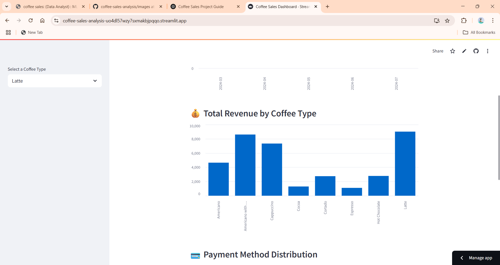
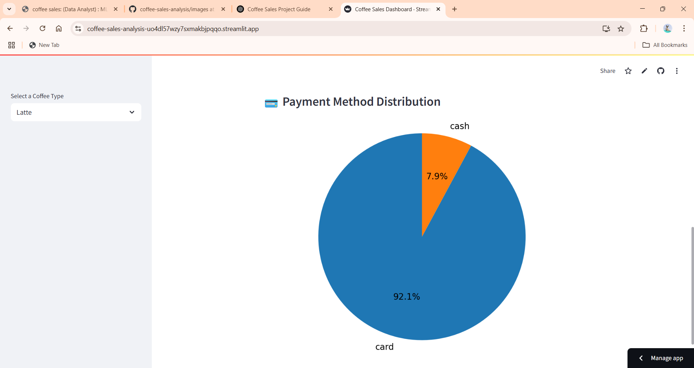
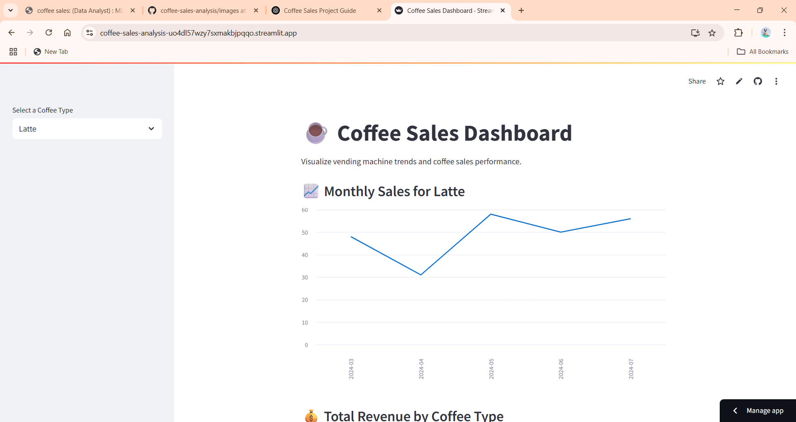


#  Coffee Sales Analytics & Revenue Forecasting

An end-to-end data science project that analyzes coffee vending machine transactions to uncover customer purchasing behavior, generate actionable business insights, and forecast sales revenue using machine learning.

---

##  Project Overview

Understanding customer purchasing patterns is essential for improving inventory planning, product strategy, and revenue forecasting.

This project explores transactional coffee sales data using exploratory data analysis (EDA), feature engineering, visualization, and machine learning to identify sales trends and predict future revenue.

---

##  Business Objectives

- Analyze customer purchasing behavior
- Identify top-performing products
- Discover peak sales periods
- Forecast future sales revenue
- Support data-driven business decisions

---

##  Tech Stack

- Python
- Pandas
- NumPy
- Matplotlib
- Seaborn
- Scikit-learn
- Streamlit

---

## Exploratory Data Analysis

The analysis focused on understanding:

- Sales trends by hour and day
- Product popularity
- Revenue contribution by product
- Customer purchasing patterns
- Peak demand periods

---

##  Machine Learning

Implemented and compared two regression models for revenue prediction:

- Linear Regression
- Random Forest Regressor

Model development included:

- Data preprocessing
- Feature engineering
- Model training
- Performance evaluation
- Feature importance analysis

---

##  Key Business Insights

- **Most Popular Drink:** Americano with Milk
-  **Highest Revenue Product:** Latte
-  **Peak Sales Hours:** 10:00 AM and 7:00 PM

These insights can help businesses:

- Improve inventory planning
- Optimize staffing during peak demand
- Increase revenue through product-focused promotions
- Support operational decision-making

---

##  Dashboard

The Streamlit dashboard enables users to:

- Explore sales trends interactively
- Visualize product performance
- Monitor revenue over time
- Analyze customer purchasing behavior
- Review forecasting results

## 📊 Revenue Dashboard




## 💳 Payment Analysis




## 🎛️ Interactive Filters




##  Repository Structure

```text
coffee-sales-analysis/
│
├── data/
├── notebooks/
├── images/
├── app.py
├── requirements.txt
├── README.md
└── coffee_sales_analysis.ipynb
```

---

##  Getting Started

Clone the repository

```bash
git clone https://github.com/Priyansha70/coffee-sales-analysis.git
```

Install dependencies

```bash
pip install -r requirements.txt
```

Run the Streamlit app

```bash
streamlit run app.py
```

---

##  Future Improvements

- Time-series forecasting using Prophet
- XGBoost regression
- Customer segmentation
- Interactive Power BI dashboard
- Inventory optimization recommendations

---

##  Author

**Priyansha Aggarwal**

B.Sc. Computer Science & Mathematics  
University of Alberta

- LinkedIn: https://linkedin.com/in/priyansha-aggarwal-520251352
- GitHub: https://github.com/Priyansha70
